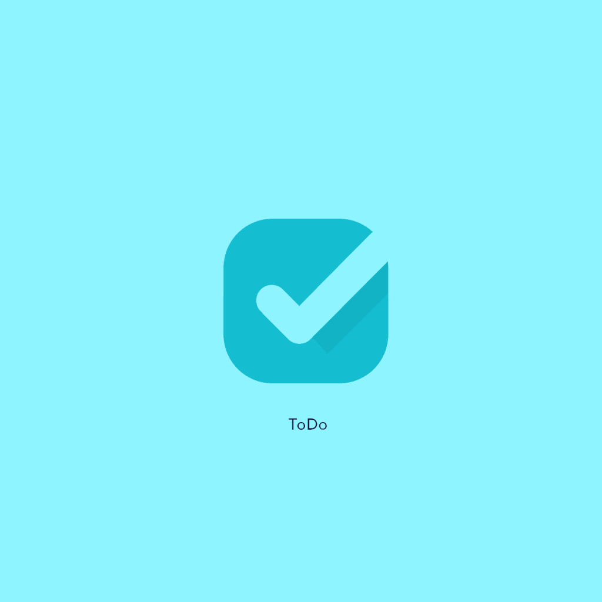

<h1 align="center">
  
</h1>

<h1 align="center">
  ToDo List - Front-end
</h1>

<p align="center">
  <a href="#sobre-o-projeto">Sobre</a> •
  <a href="#como-executar-o-projeto">Como executar</a> •
  <a href="#tecnologias">Tecnologias</a> •
  <a href="#autor">Autor</a> •
  <a href="#licença">Licença</a>
</p>

## Sobre o projeto

Projeto criado com a finalidade de praticar e aperfeiçoar minhas stacks, dentre elas, estão, React Native e Typescript. 

## Como executar o projeto

### Pré requisitos

Antes de começar, você vai precisar ter instalado em sua máquina as seguintes ferramentas:
[Git](https://git-scm.com), [Node.js](https://nodejs.org/en/).
Além disto é bom ter um editor para trabalhar com o código como [VSCode](https://code.visualstudio.com/)

#### Rodando a aplicação web (Frontend)

```bash

# Clone este repositório
$ git clone git@github.com:JacksonSantin/todolist_front.git

# Acesse a pasta do projeto no seu terminal/cmd
$ cd todolist_front

# Instale as dependências
$ yarn

# Execute a aplicação em modo de desenvolvimento
$ yarn start 


```

---

## Tecnologias

As seguintes ferramentas foram usadas na construção do projeto

#### **Website** ([React Native](https://reactnative.dev/) + [TypeScript](https://www.typescriptlang.org/))

-   **[Feather Icons](https://feathericons.com/)**
-   **[Expo](https://expo.io/)**

> Veja o arquivo [package.json](https://github.com/JacksonSantin/curriculum_vitae/blob/master/web/package.json)

## Autor


<br />
<sub><b>Jackson Dhanyel Santin</b></sub>
<br />

[](https://www.linkedin.com/in/jackson-dhanyel-santin/) 
[](mailto:jackdhanyelsn@gmail.com)

## Licença 

Este projeto está sobe a licença [MIT](./LICENSE).

Feito com ❤️ por Jackson Dhanyel Santin 👋🏽 [Entre em contato!](https://curriculum-vitae-jacksonsantin.vercel.app/contato)
